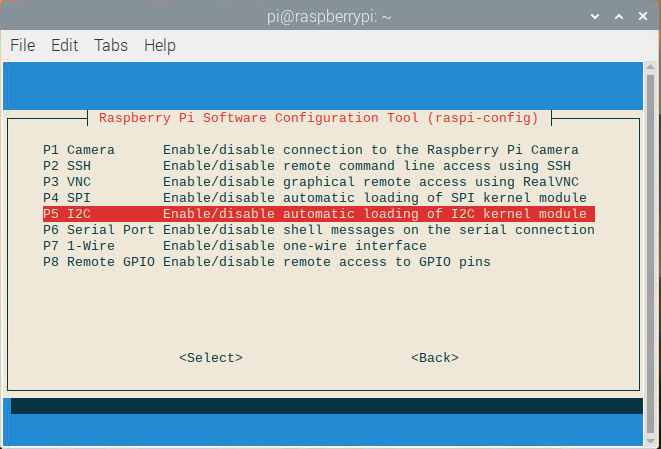
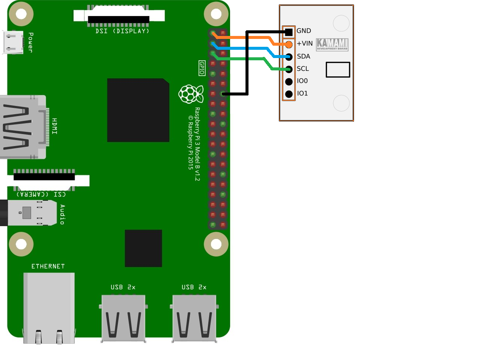

# iotsoftbox liveobject sample ambient light and distance

Here is the table of content:

- [Aim of the example](#aim-of-the-example)
- [Enable the example](#enable-the-example)
- [Sensor](#sensor)
	- [Wiring](#wiring)


## Aim of the example

This example represents the minimal amount of code necessary to upload data to the LiveObject platform. It doesn't use simulated data but ones from a [sensor](#sensor). In this document you will find how to enable the compilation of the example and how to install a specific library to use the GPIO of the Raspberry Pi.

The compilation process is no different from the other one because everything is automated by cmake.

## Enable the example

Go inside the top level cmake and uncomment the following line :

```cmake
#add_subdirectory(liveobjects_sample_amb_dist)
```
Enable (if needed) **I2C** interface on your Raspberry Pi using terminal and command:
```bash
sudo raspi-config
```
and selecting: **3 Interface Options** -> **P5 I2C** -> **\<Yes\>**



## Sensor

The [VL6180X](https://www.st.com/en/imaging-and-photonics-solutions/vl6180x.html) is the latest product based on ST’s patented FlightSense™technology. This is a ground-breaking technology allowing absolute distance to be measured independent of target reflectance. Instead of estimating the distance by measuring the amount of light reflected back from the object (which is significantly influenced by color and surface), the VL6180X precisely measures the time the light takes to travel to the nearest object and reflect back to the sensor (Time-of-Flight).
Description from st.com.


### Wiring


<br>

Example of development module using VL6180X you can find [here](https://kamami.pl/en/kamod-kamami-peripheral-modules/559362-kamodvl6180x-a-module-with-distance-gesture-and-als-sensor.html). Below diagram shows how to connect it to Raspberry Pi.


