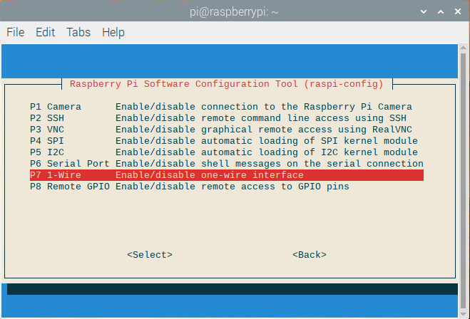
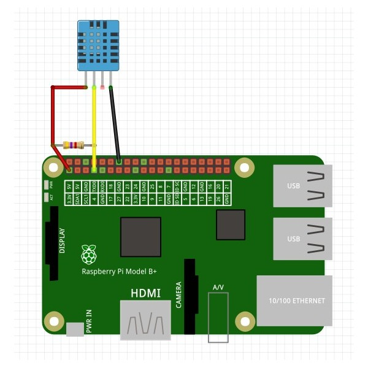

# iotsoftbox liveobject sample minimal

Here is the table of content:

- [Aim of the example](#aim-of-the-example)
- [Enable the example](#enable-the-example)
- [Sensor](#sensor)
	- [Wiring](#wiring)
- [Third party lib](#third-party-lib)
	- [Installation](#installation)
	- [Usage](#usage)

## Aim of the example

This example represents the minimal amount of code necessary to upload data to the LiveObject platform. It doesn't use simulated data but ones from a [sensor](#sensor). In this document you will find how to enable the compilation of the example and how to install a specific library to use the GPIO of the Raspberry Pi.

The compilation process is no different from the other one because everything is automated by cmake.

## Enable the example

Go inside the top level cmake and uncomment the following line :

```cmake
#add_subdirectory(liveobjects_sample_minimal)
```
Enable (if needed) **1-Wire** interface on your Raspberry Pi using terminal and command:
```bash
sudo raspi-config
```
and selecting: **3 Interface Options** -> **P7 1_Wire** -> **\<Yes\>**



## Sensor

The [DHT11](https://www.adafruit.com/product/386) is a basic, ultra low-cost digital temperature and humidity sensor. It uses a capacitive humidity sensor and a thermistor to measure the surrounding air, and spits out a digital signal on the data pin (no analog input pins needed). Its fairly simple to use, but requires careful timing to grab data.<br>
Description from Adafuit.com.

### Wiring


Source: https://community.mydevices.com/t/dht11-dht22-with-raspberry-pi/2015


